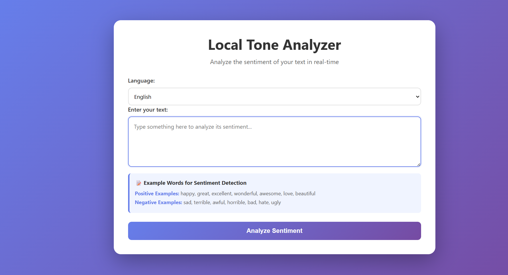
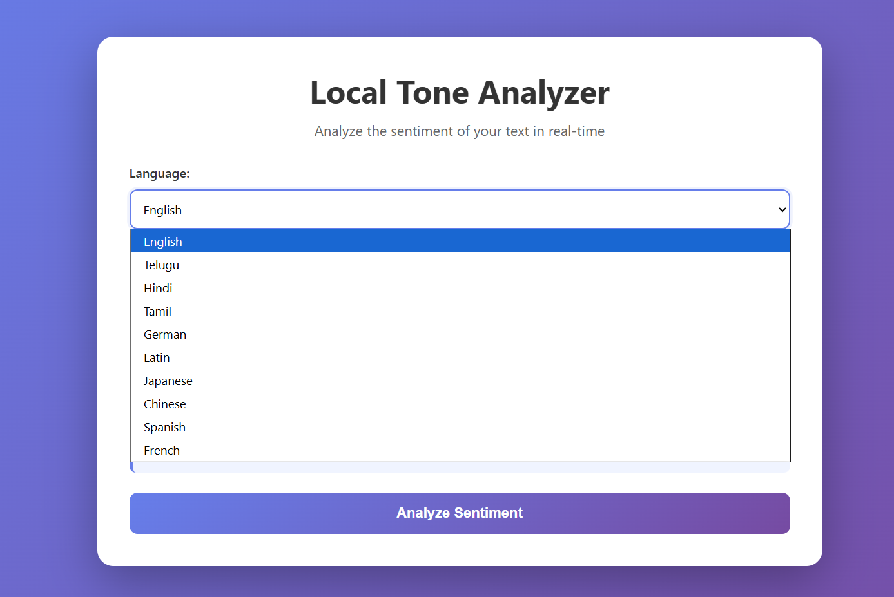
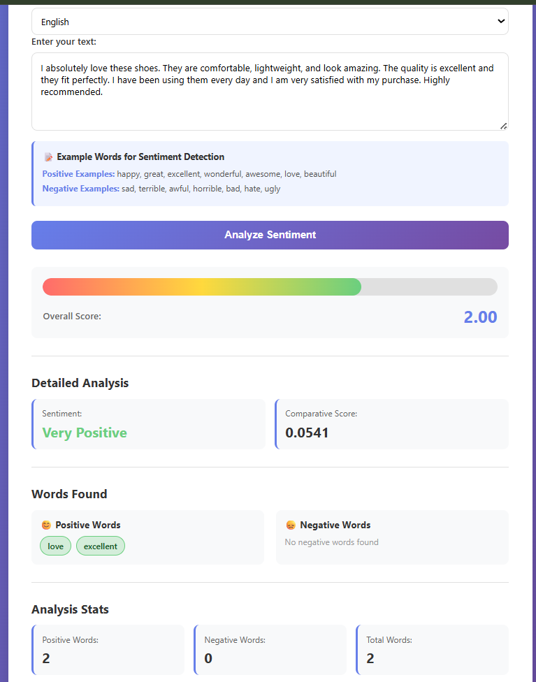
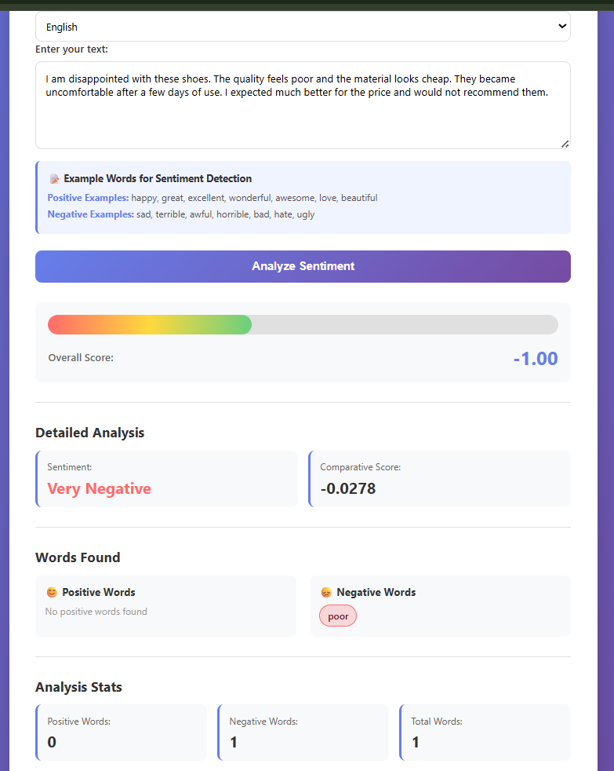

# Local Tone Analyzer

A web-based NLP application that analyzes the sentiment and tone of user-provided text in real time. The system processes text input and classifies it as positive, negative, or neutral, helping users better understand the emotional context of their messages.

## Screenshots

### Homepage


### Language Selection


### Positive Sentiment Analysis


### Negative Sentiment Analysis


## Features

- Multi-language sentiment analysis
- Real-time text sentiment detection
- Positive and negative word extraction
- Comparative sentiment scoring
- Interactive and responsive user interface
- Support for 10 languages
- Word-level sentiment breakdown
- REST API integration
- Cross-platform browser support
## Tech Stack

**Frontend:** HTML5, CSS3, JavaScript

**Backend:** Node.js, Express.js

**Libraries:** Sentiment.js, CORS

**Deployment:** Vercel
## Installation

Install dependencies

```bash
npm install
```
## Run Locally

Clone the project

```bash
  git clone https://github.com/rexter001/local-tone-analyzer.git
```

Go to the project directory

```bash
  cd local-tone-analyzer
```

Install dependencies

```bash
  npm install
```

Start the server

```bash
  npm start
```

Open the browser

```bash
  http://localhost:3000
```


## Usage/Examples

```javascript
1. Select a language from the dropdown menu.
2. Enter text into the input field.
3. Click **Analyze Sentiment**.
4. View:
   - Sentiment score
   - Comparative score
   - Positive words detected
   - Negative words detected
   - Overall sentiment classification
```


## Roadmap

- Improve sentiment accuracy

- Add more language support

- Add sentiment history tracking

- Add file/text document analysis

- Implement AI-based sentiment models

- Add data visualization dashboard

- Enhance mobile responsiveness


## Authors

- [@Khaja Mastan Shaik](https://github.com/rexter001)
